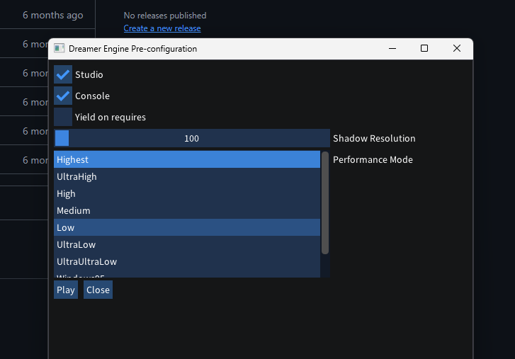
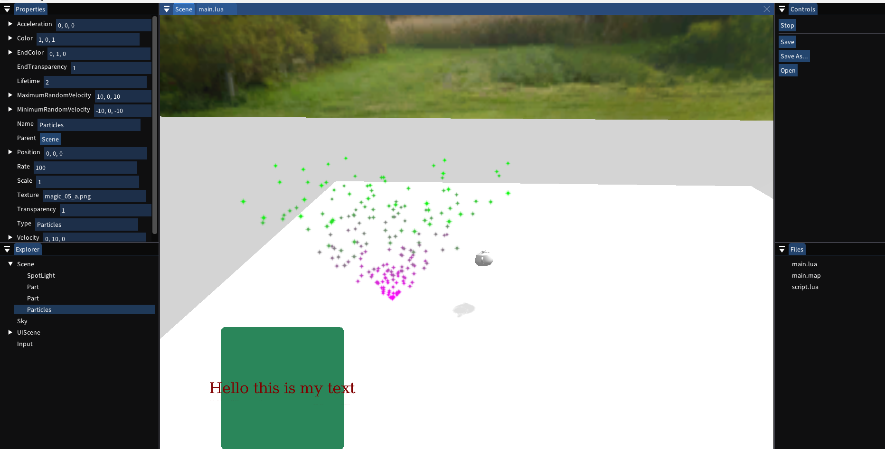
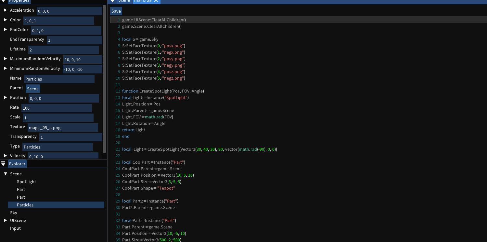

# Overview

Dreamer Engine is currently a passion project solely created by me (Richards).
It encompasses a lot of the skill I've developed in the past year in C++ coding.

A TODO list is present in the main.cpp file.

This project uses: OpenGL, Lua, imgui, stb

# Pictures

# Building

Use CMake with the MSVC compiler for Windows, use CMake with the Clang++ compiler for Linux.

## License

This project is source-available and is NOT licensed for commercial use.

All rights are reserved unless otherwise stated. You may view the
source code for personal evaluation, but you may not 
commercially use or use this repository or its contents for
training, fine-tuning, evaluating, or developing AI/ML models without
written permission from the copyright holder.

See [LICENSE](LICENSE) for the complete terms.